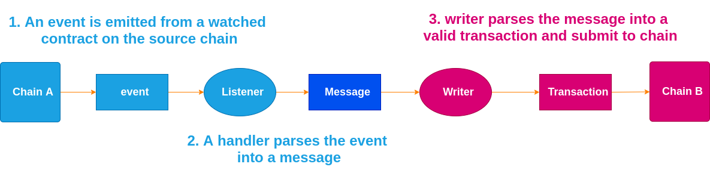

# Platdot

English | [简体中文](./docs/README_CN.md)

           

[communicate with us](https://matrix.to/#/#platdot-faucet:matrix.org?via=matrix.org)

## The cross-chain Bridge

`Platdot` is a cross-chain bridge based on [ChainBridge](https://github.com/ChainSafe/ChainBridge), it provides `Polkadot` cross-chain bridge for `Platon` to realize the functions of PDOT **issuance**, **redemption** and **transfer**.

## Overview

Currently, Platdot operates under a trusted federation model, and users can complete mortgage issuance and redemption operations at a very low handling fee. It is now in the testing phase and has realized the circulation of KSM and AKSM.The [UI](https://github.com/Platdot-network/Platdot-UI) page looks like this:

## Features

On the PlatON network, EVM's smart contract can implement custom processing behaviors when receiving transactions, such as issuing and destroying new token. On the Polkadot network, multisig-pallet provides a multi-signature function, and Platdot designs accordingly to complete mortgage and redemption. For example, locking DOT assets on the Polkadot network and executing contracts on the EVM can mint and issue PDOT assets. Similarly, executing contracts on the EVM can destroy PDOT assets and redeem DOT assets from Polkadot's multi-signature addresses.

## Installation

### Prerequisites

- Make sure the `Go` environment is installed

### Building

`git clone https://github.com/RJman-self/Platdot.git`

`make build`: Builds `platdot` in `./build`.

**or**

`make install`: Uses `go install` to add `platdot` to your `GOBIN`.

## Getting Start

Documentations are now moved to `GitHub Wiki`.

[Start Platdot as a relayer](https://github.com/Platdot-network/Platdot/wiki/Start-Platdot-as-a-relayer)

## License

The project is released under the terms of the `Apache v2`.
